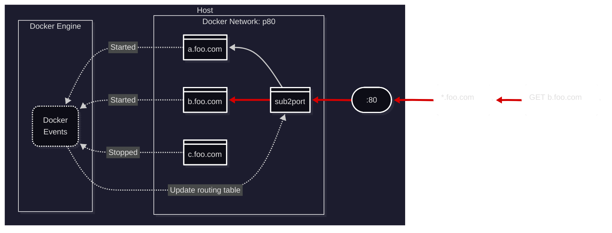

# Sub 2 Port

- Route requests to docker containers by host name
- Containers declare their own host name, so the config is decentralized
- The routing table updates automatically in response to docker events
- Ports never have to be exposed, so no more errors about ports already in use
- Multiple containers bound to the same host name are routed LIFO

## Why?

The existing reverse proxies for docker have a lot of open issues, because they
manage an nginx config and must support its API. I just proxy host names with go.
Any other features you need should probably sit in front of or behind this container.

## Compose

See the `examples` folder for docker compose configuration examples.

```sh
docker compose -f examples/docker-compose.proxy.yml up -d
docker compose -f examples/docker-compose.nodes.yml up -d
```

## Setup a proxy

Create a shared network for the containers:

```sh
docker network create p80
```

- `<name>` - Any network name as long as the containers match

Start the sub2port container:

```sh
docker run -d -p 80:80 --network p80 -v /var/run/docker.sock:/var/run/docker.sock:ro deckar01/sub2port
```

 - `-p <port>:80` - Any host port can be used, but the container listens on 80
 - `-v <sock>:...` - The socket for connecting to the docker API (your system may be different)

## Route a host name

Route `test.com:80` to port 5555 in a container:

```sh
docker run -d -e SUB2PORT=test.com:5555 --network p80 your/image
```

 - `-e SUB2PORT=<host>(:port)[,...]`
   - A host name is required
   - The container port is optional and defaults to the first open port (does not have to be exposed)
   - Additional hosts can be separated with commas
 - `--network <name>` - The network that is joined determines the host port that is used

## Contributing

Prefer publishing a fork to opening a feature request.

Run your fork in production for a while before opening a pull request.

The `.github/workflows/docker-publish.yml` action publishes on push. Follow [these docs](https://github.com/elgohr/Publish-Docker-Github-Action?tab=readme-ov-file#mandatory-arguments) to start publishing your changes.


